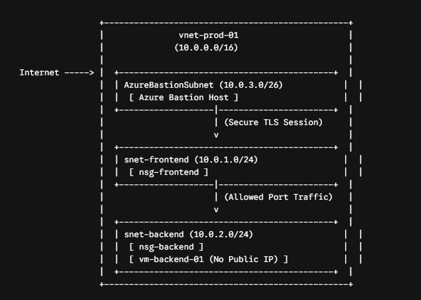

#Overview

This project demonstrates the design and deployment of a secure, enterprise-grade multi-tier Virtual Network (VNet) in Microsoft Azure. The architecture enforces strict network segmentation and perimeter security by isolating backend database/application workloads from direct public internet exposure. Remote infrastructure management is accomplished securely using an Azure Bastion Host integrated into a dedicated subnet, providing encrypted management access without requiring public IP addresses on internal servers.

##Technical Specifications & Subnets

Resource Group: rg-project1-network-prod

Address Space: 10.0.0.0/16

Subnet Architecture:

snet-frontend (10.0.1.0/24): Hosts web and public-facing workloads.

snet-backend (10.0.2.0/24): Hosts database and backend processing workloads.

AzureBastionSubnet (10.0.3.0/26): Dedicated tier for Azure Bastion connectivity.

###Security & Access Controls

Frontend NSG (nsg-frontend): Attached to snet-frontend, configured to allow inbound HTTP (80) and HTTPS (443) traffic while denying unauthorized requests.

Backend NSG (nsg-backend): Attached to snet-backend, enforcing micro-segmentation by strictly allowing inbound traffic originating only from the frontend subnet (10.0.1.0/24).

Zero-Trust Remote Management: Implemented Azure Bastion (bastion-prod-01) with a public IP (pip-bastion-prod) to negotiate RDP/SSH sessions directly in the portal over HTTPS, allowing virtual machines (vm-backend-01) to run with zero public IP allocation.

####Verification & Validation

Private Subnet Provisioning: Provisioned vm-backend-01 inside snet-backend without assigning a public IP interface.

Bastion Gateway Access: Successfully initiated a secure RDP/SSH management session to vm-backend-01 via Azure Bastion through the Azure Portal.

Automated Teardown: Executed PowerShell commands (Remove-AzResourceGroup -Force -AsJob) to gracefully clean up all provisioned cloud resources, preventing unnecessary compute and networking charges.
